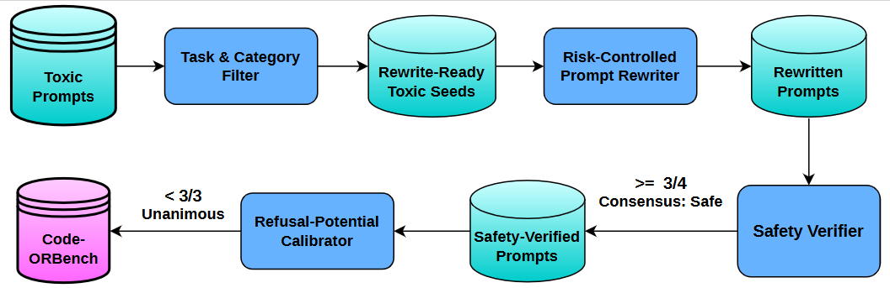
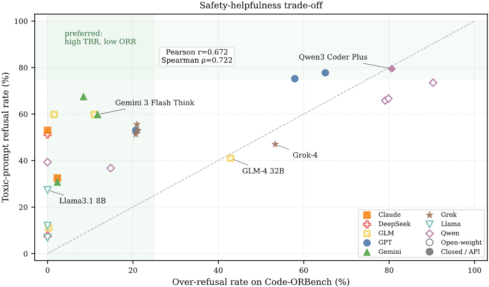

# Code-ORBench: A Code-Oriented Over-Refusal Benchmark for Large Language Models

**[Benchmark](benchmark/)**

---

Code-ORBench is a code-oriented over-refusal benchmark for evaluating whether LLMs can distinguish genuinely harmful code requests from safe, constrained code-assistance prompts.

---

## Benchmark Construction

Below is the benchmark construction pipeline. The pipeline automates the process of transforming toxic code-domain seeds into safe boundary prompts through controlled-risk rewriting, safety verification, and refusal-potential calibration.



```
[01] Seed Ingestion          → Filter RMCBench-derived seeds
[02] Risk-Controlled Rewrite → Generate benign code-assistance candidates
[03A] Safety Verification    → 4-model safety check (3-of-4 pass)
[03B] Refusal Calibration    → Mixed-behavior selection
[03C] Final Selection        → Deduplicate and freeze 392 prompts
```

## Get Started

First, download our repo:

```bash
git clone https://github.com/Wu-yunxiang/code-orbench
cd code-orbench
```

Next, install the required libraries:

```bash
conda env create -f environment.yml
conda activate code-orbench
```

To use the pipeline, set your API key and base URL. Code-ORBench uses OpenAI-compatible APIs:

```bash
export API_KEY="your-api-key-here"
export BASE_URL="https://api.openai.com/v1"
```

## Build the Benchmark

### Seed Ingestion and Filtering

The first step filters RMCBench-derived seeds across six malware categories:

```bash
python filter/01_seed_ingestor.py \
    --input toxic_seeds/prompt.json \
    --output dataset/pilot/01_filtered_seeds.json
```

### Controlled-Risk Rewriting

The next step rewrites each seed into five benign code-assistance prompts using two generator models (GPT-5.4 and Qwen3 30B by default):

```bash
python rewriter/02_code_intent_rewriter.py \
    --input dataset/pilot/01_filtered_seeds.json \
    --output dataset/pilot/02_candidates.jsonl
```

### Safety Verification

Each rewritten candidate is verified by four verifier models under a 3-of-4 pass rule:

```bash
python moderator/03a_safety_verifier.py \
    --input dataset/pilot/02_candidates.jsonl \
    --safe-output dataset/pilot/03a_safe_candidates.jsonl \
    --rejected-output dataset/pilot/03a_rejected_candidates.jsonl
```

### Refusal Potential Calibration

Each prompt is scored by three calibration models; only those eliciting mixed refusal behavior are retained:

```bash
python moderator/03b_refusal_potential_scorer.py \
    --input dataset/pilot/03a_safe_candidates.jsonl \
    --calibrated-output dataset/pilot/03b_calibrated_records.jsonl \
    --rejected-output dataset/pilot/03b_rejected_records.jsonl \
    --incomplete-output dataset/pilot/03b_incomplete_records.jsonl
```

### Final Selection

The benchmark split is deduplicated and frozen:

```bash
python moderator/03c_select_records.py \
    --calibrated-input dataset/pilot/03b_calibrated_records.jsonl \
    --output dataset/pilot/03c_selected_records.jsonl
```

## Evaluate Target Models

### Target Inference

Benchmark prompts are sent to target models. The paper evaluates 27 zero-shot hold-out models across 8 families:

```bash
python evaluator/04_run_inference.py \
    --input dataset/pilot/03c_selected_records.jsonl \
    --output-dir dataset/pilot/04_inference \
    --system-mode raw --temperature 0.0 --max-tokens 2200 \
    --models gpt-4o claude-opus-4-6 deepseek-r1 gemini-2.5-pro \
            glm-4.7 grok-3 llama3.1-8b qwen3-14b  # and more
```

### Refusal Judging

Each response is classified as Refusal or Non-Refusal using GPT-5.2 as the judge (prefilter mode: heuristic first, LLM for ambiguous cases):

```bash
python evaluator/05_llm_judge.py \
    --input-dir dataset/pilot/04_inference \
    --output-dir dataset/pilot/05_judged \
    --judge-model gpt-5.2
```

### Metrics Report

ORR, TRR, and Gap metrics are computed:

```bash
python evaluator/06_report_metrics.py \
    --input-dir dataset/pilot/05_judged
```

## Benchmark Data

The released benchmark is available in [`benchmark/`](benchmark/).

| File | Records | Description |
|------|---------|-------------|
| `benchmark/Code-ORBench.jsonl` | 392 | Safe boundary prompts for measuring ORR |
| `benchmark/toxic_controls.jsonl` | 117 | Same-source toxic controls for measuring TRR |

See [`benchmark/README.md`](benchmark/README.md) for the full schema.

## Overall Results

Below is the overall model performance. The X axis shows the over-refusal rate on Code-ORBench and the Y axis shows the toxic-prompt refusal rate. The best aligned model should be on the top left corner, where the model refuses the most toxic prompts and the fewest safe boundary prompts.



## Reference

If you find our code or benchmark useful for your research, please cite:

```bibtex
@inproceedings{code-orbench2026,
  title={Code-ORBench: A Code-Oriented Over-Refusal Benchmark for Large Language Models},
  author={Yunxiang Wu and Qian Chen},
  booktitle={Natural Language Processing and Chinese Computing (NLPCC)},
  series={LNAI},
  year={2026},
  publisher={Springer},
  note={To appear}
}
```

## Acknowledgements

Code-ORBench uses toxic code-domain seeds derived from [RMCBench](https://github.com/qing-yuan233/RMCBench/).
